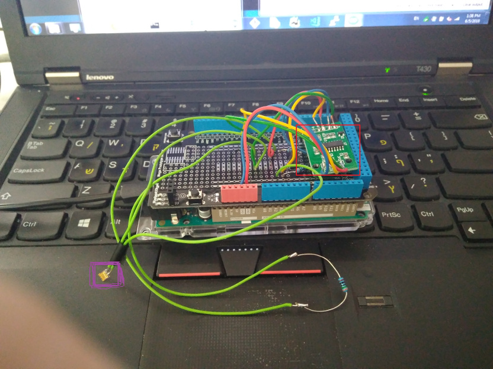
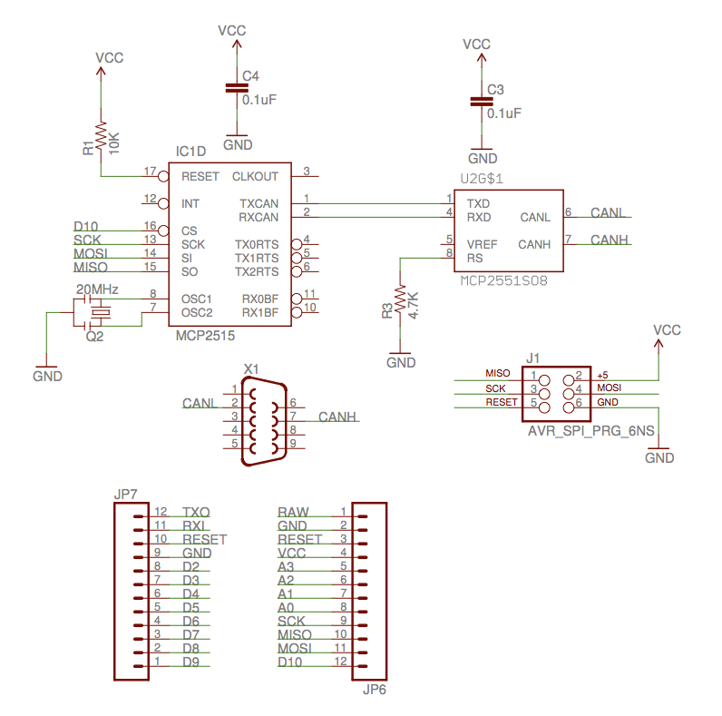

# Arduino Strain gauge
Arduino + strain gauge for sensitive stress detection 

The Project have been used for "hands on wheel" detection for car simulator, but can be used in general for sensitive stress detection using Arduino. 
For full details, see the attached paper.

